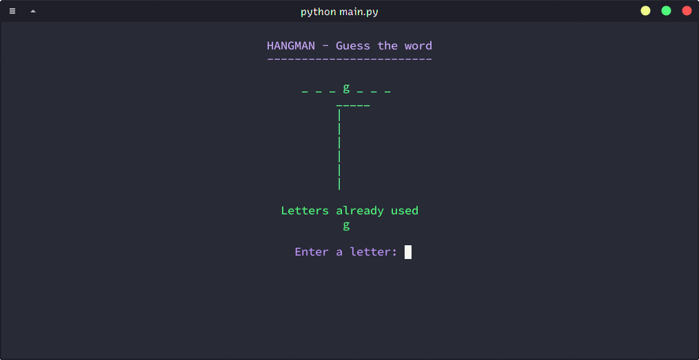

# Hangmant

A terminal based hangman game

## Requirements

Python 3.6+

## Required modules

* getch
* random
* os
* time

## Notes

The game centres itself on a terminal based on the number of columns in it.
The game uses the output of `stty size` to find the number of columns in the
terminal and adjust itself accordingly. This shouldn't be a problem in a \*nix
terminal. This value is set to 80 on Windows, and can be changed manually.
